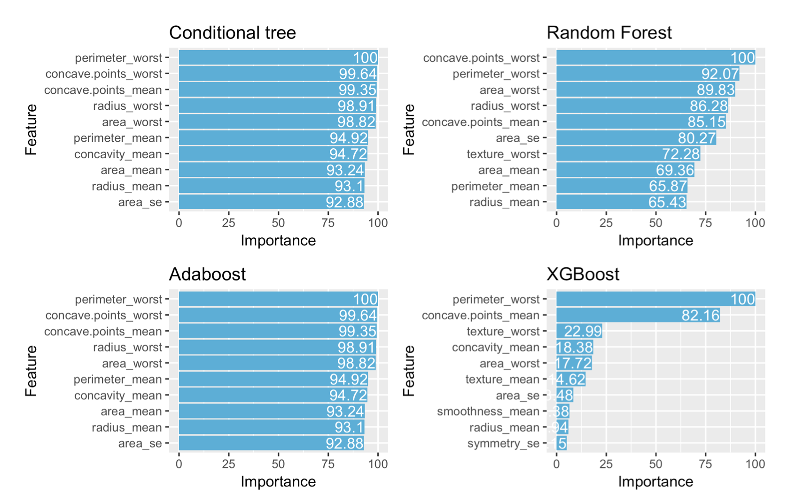

# Cell Nucleus Diagnosis
###### Comparison of breast cancer classification performance using ML algorithms
`12/2016`

# DATA
The data can be found online in the UCI Machine Learning Repository and consists of 569 observations with 32 variables. The variables are ID, diagnosis, and ten real-valued features computed for each cell nucleus: radius (mean of distances from center to points on the perimeter), texture (standard deviation of gray-scale values), perimeter, area, smoothness (local variation in radius lengths), compactness (perimeter2/area-1), concavity (severity of concave portions of the contour), concave points (number of concave portions of the contour), symmetry and fractal dimension (coastline approximation-1) 

Of all these measures the mean, standard error and ‘worst’ or largest of these features were computed for each images. Worst is calculated as the average of the 3 largest measures. This results in 30 variables for each observation. All feature values are recoded with four significant digits. The dataset has no missing attribute values so no preparation steps or cleaning is required beforehand. Since the dependent variable, diagnosis, consists of two possible outcomes this is a classification problem. Classes are not completely equal in distribution with 357 benign and 212 malignant observations. 

# METHOD & RESULTS

### `CLUSTER ANALYSIS`

The goal of clustering is to find subgroups in the data where observations are similar within a group but different across groups. Many approaches exist, one widely used algorithm is K-Means which is based on defining a centroid for each cluster (K). Observations get assigned to the nearest centroid and the centroid is recalculated based on the new grouping, this is repeated until no points change group membership anymore.

Before k-means clustering can be applied the first issue is specifying the amount of clusters (K). There is no general theoretical solution but many internal indices exist. For this diagnostic dataset we are interested in distinguishing two different groups namely, benign and malignant cancer. It may be interesting to see if internal indices are also able to discover this structure in the data. An ‘Elbow-Plot’ would result in K is 4 or 5 and Calinski-Harabasz gives the highest value for K is 9 whereas Average Silhouette Width does result in the highest value for K is 2. Other indices exist but it is clear that determining K is not straightforward and the results vary. For interpretation and comparability, 2 clusters are used for further analysis.

A second issue is how to choose the position of the initial starting centroids, different choices can influence the results. One possible and simple solution is using multiple random starts where the solution with the lowest within cluster variation is selected. Another option is using a smart start where the initial centroid placement can be specified. In the following applications we employ 50 random starts and a random seed as suggested by (ISL). First ‘basic’ k-means clustering is applied. FIGURE 1 displays a plot of the obtained grouping and TABLE 1 shows a comparison of the results with the actual diagnosis. All benign observations are grouped together except for one. This does not hold for the malignant class which appears in both. Imbalance in the classes could play a role here since k-means prefers groups of equal sizing.

30 variables are currently used to find structure in the data. Looking at the measures used as variables, intuitively there will be correlations. This is confirmed by plotting a correlogram, FIGURE 2 displays a selection of some correlated measures. This means not all variables will be of equal importance in predicting the diagnosis. To reduce variables and focus on the important variables we can apply a PCA. After performing a PCA we see the first 2 components together explain 63.3% of the variance in the data. Based on a scree-plot we conclude in using the first 3 PCA’s that together explain 72.6%. Many variables appear to contribute in the first 3 principal components but worst radius, worst perimeter and mean area are the most important.

 
! K-means table

### `FACTORIAL K-MEANS`

An approach that combines a PCA with clustering is tandem analysis (Arabie & Hubert). However, the dimensions obtained by the PCA are not necessarily the most important for the clustering structure in the data and may even mask the structure since two different objective functions are minimized (Vichi & Kiers). A solution may be Factorial K-Means (FKM) which also combines component analysis with clustering, but does so simultaneously and now optimizes a single objective function. The aim is to select the variables which contribute the most to the clustering structure. The clustering obtained by FKM is plotted in FIGURE 2 and TABLE 1 shows a comparison of the results with the actual diagnosis.

It is clear from the clustering plot and the grouping results that FKM fails to discover a meaningful structure while an improvement may have been expected by focusing on the important variables. A potential explanation is given by (Vichi & Kiers). If the data contains dimensions with low variance the algorithm may focus on these dimensions since the loss function can now be quickly decreased. This is a plausible explanation for the bad performance of FKM on this dataset since 9 of the 30 variables have a variance below the order of . Another explanation may be given by masking of the clusters. Ignoring the variables with low variance may avoid this issue but this would mean deleting large part of our dataset which is not a good solution. Also, overlapping of the clusters decreases the ability to recover group membership (Timmerman).

### `REDUCED K-MEANS`

An alternative to FKM is Reduced K-Means (RKM). Timmerman claims that RKM is of use if FKM fails (and vice versa). A simulation by shows that an increase in subspace residuals relative to complement residuals decreases performance of FKM but increases performance of RKM (Timmerman). I am not sure If that is the case here but I could potentially explain the large difference in performance between FKM and RKM. The clustering obtained by FKM is plotted in FIGURE 3 and again TABLE 1 show a comparison of the results with the actual diagnosis. Based on the confusion RKM yields the best result in identifying a clustering structure where the benign and malignant observations are seen as two separate classes.

 

### `TREE BASED SUPERVISED LEARNING`

Decision tree algorithms classify observations by splitting the data into groups based on the covariates. It is called recursive partitioning because this group could be split again into smaller groups. The partitioning can be done in many ways. Some common problems with CART and other algorithms are overfitting and biased variable selection. Conditional trees aim to solve both problems by using conditional inference for selection of the covariate to split and early stopping criterion.

Decision trees are flexible and are able to make accurate predictions. However, the low bias may come for the price of high variance (bias-variance tradeoff). This means the results can be sensitive to changes in the data. An idea to reduce the variance while preserving the low bias of our predictions is by using an ensemble of trees such as Random Forest (RF). RF decreases variance while preserving low bias by combining the results of multiple unpruned trees. Ideally, the trees are independent. To achieve this, each tree is based on a selection of random observations as well as random selection of covariates to split on. 

Another approach using an ensemble of trees is called boosting, which incorporates learning into the resampling process. The idea is to emphasize the observations that were harder to predict in the next tree instead of using completely random samples to obtain independent trees as in RF. This is achieved by iteratively increasing the weight for incorrect predictions during the fitting. A well known method is Adaboost (Adaptive Boosting). Another form of boosting is XGBoost (eXtreme Gradient Boosting) which is based on the Gradient Boosting Framework by (Friedman). Very simply put; instead of weights now gradients are used. 

To predict diagnosis based on our measures a conditional tree, Random Forest (RF), Adaboost and XGBoost are applied. To make predictions for diagnosis the data is randomly split into a training and testing set. First the observations are permuted and then split into 70% for training purposes and 30% for testing. Model performance can be compared by several measures such as accuracy (hit rate). Accuracy may not always give a realistic view since if classes are imbalanced. Therefore, sensitivity; the true positive rate (or recall) and specificity; the true negative rate are also calculated. In this case the malignant class is specified as positive, which corresponds to correctly identifying disease, as would be the case in the medical field. As final measure the Area Under ROC curve is calculated (AUC) which also uses the true positive and negative rate. At baseline the AUC equals 0.5 and a perfect classifier would result in a value of 1. To ensure reliability of the results repeated 10-fold cross validation is used in all models. This excludes the accidental case that our results are dependent on the specific partitioning that was done for the training and test set.

Performance can be improved by optimizing (tuning) the parameters used in the model. To find the optimal combinations a grid search is employed, tuning is done only on the training set. (Could be done more efficiently with the Nelder-Mead algorithm). RF usually does not require much tuning since the whole idea is using unpruned trees. However, using more trees can increase performance. In this case we have a relatively small sample and using the default of 500 trees is sufficient. The optimal amount of covariates considered per split (mtry) is found to be 2, this is quite different from the default which would be . On contrary, XGBoost has many parameters and is highly tunable. Again a grid search is used for parameter optimization.  A bonus of RF is the possibility to exploit the out-of-bag (OOB) observations that were not used in a specific tree for prediction (about ⅓). The OOB error gives a good estimate of out of sample prediction performance (Breiman). 

To compare models, the focus is on prediction accuracy. An overview of the abovementioned models is seen in TABLE 2. None of the tested models display ‘bad’ results. The conditional tree performs the worst by wrongly classifying 17 observations. RF performs slightly better than Adaboost, which is also reflected in a higher accuracy and AUC. XGBoost proves the most accurate in all used performance measures. The sensitivity is lower than the specificity in all models. This is most likely caused by the train sample containing less observations of the malignant class, leading to increased difficulty of predicting this class in the test sample compared to benign observations. In our RF model the OOB error is 4.59% this implies 95.41% accuracy and is almost identical to the independently calculated hit rate.

! table

As we are interested in finding which measures are important in correctly predicting diagnosis we can look at variable importance in each model. Importance is determined by calculating the average decrease in Gini index due to splitting. FIGURE 5 shows a scaled comparison of the top 10 most important variables for each model. The same variables appear in the top 5 of every model except for XGBoost. Most noticeable is the significant drop in importance after the first two variables of XGBoost compared to all other models where the variable importance is much more equally distributed. Measure of worst perimeter is the most important in all models except for RF where it is second. Furthermore, concavity measures of the nucleus are also an important variable in all models. As follow-up the least important variable(s) can be removed to see if this has a positive impact on the predictions and this step can be repeated.

Further analysis of the RF and XGBoost model reveals that good prediction results can be obtained by including only a selection of the measures, displayed in TABLE 4. Retuning with repeated 10-fold cross validation and predicting diagnosis leads to the results shown in TABLE 3. Although the performance in both models is slightly lower than using all measures, this provides valuable information regarding which variables are most significant in accurately determining the diagnosis of future patients.

! table

### `SUPPORT VECTOR MACHINE`

As final approach we classify our observations using a support vector machine (SVM). This method could work well since we have a binary classification problem. The idea is to find the best split between the benign and malignant class. This is done by non-linearly mapping the observations into a high dimensional feature space in which the best linear split is determined called the optimal separating hyperplane. Actual calculations in the higher-dimensional space are avoided by the “kernel trick”. Several kernels are available such as polynomial and radial basis function (RBF). Choosing the correct kernel is not straightforward, different ones are compared to see which yields the best performance on this dataset. Results can again be improved by tuning the (hyper)parameters in the model. The performance using the following kernels are compared; linear, polynomial, radial and sigmoid. The same training and test set as in the tree based methods is used. For each method grid search in combination with 10-fold cross-validation is applied to find the optimal value for epsilon, cost (C) and gamma. tuning was performed only on the training set. TABLE 3 shows a comparison of the SVM predictions. All kernels yield comparable results and prove to have high prediction accuracy. Sigmoid has the best performance with an accuracy of 97.18% highest sensitivity, specificity and AUC, all just below XGBoost.

! Table

# SUMMARY & CONCLUSION

For the clustering analysis, ideally two segments would be found in the data; one with benign observations and the other containing the malignant observations. K-means analysis produced mixed results. Basic k-means managed to obtain a cluster which included almost all benign observations but this was not achieved for the malignant observations. Factorial k-means performed significantly worse obtaining two clusters with mixed observations. Reduced k-means finds the best clustering structure in the sense of separating the benign and malignant class.

All tree based supervised learning methods have similar results. Conditional trees, RF, Adaboost and XGBoost all result in an accuracy of at least 90% as well as an AUC value of over 0.90. Most accurate predictions based on all the used performance measures are obtained with XGBoost. The most important measures in predicting diagnosis are found to be: worst perimeter, mean of concave points and worst area.

As final approach SVM is used for predictions, again we find that every tested kernel has comparable performance, all hit rates are above 96% and AUC values are above 0.94. Using a Sigmoid kernel delivers the highest prediction performance, just below XGBoost with an accuracy of 97.18%.

The obtained hit rate of 97.74% by XGBoost is comparable to the reported classifier of 97.5% that is (or was) actually used in predicting diagnosis of new patients. The results are promising and further improvement could potentially be achieved by extensive optimization of the variable selection and retuning.

# REFERENCES

* Arabie, P., and L. Hubert (1994), "Cluster Analysis in Marketing Research," in Advanced Methods of Marketing Research, R. P. Bagozzi, ed. Oxford: Blackwell, 160-189.
* Breiman, L. (1996b). Out-of-bag estimation. Technical report, Dept. of Statistics, Univ. of Calif., Berkeley. 
* Cawley, C., Talbot, N.
(2010). On Over-fitting in Model Selection and Subsequent Selection Bias in Performance Evaluation Journal of Machine Learning Research 11, pp. 2079-2107 
* Friedman, J. H., (2001). Greedy Function Approximation: A Gradient Boosting Machine. The Annals of Statistics, Vol. 29, No. 5 (October), pp. 1189-1232 
* Hothorn, T., Hornik, K., & Zeileis, A. (2006). Unbiased Recursive Partitioning: A Conditional Inference Framework. Journal of Computational and Graphical Statistics, 15(3) ,pp. 651-674. 
* James, G., Witten, D., Hastie, T., & Tibshirani, R. (2013). An introduction to statistical learning: with applications in R. New York: Springer. (ISL)
* Timmerman, M. E., Ceulemans, E., Kiers, H. A., & Vichi, M. (2010). Factorial and reduced K-means reconsidered. Computational Statistics & Data Analysis, 54(7), pp. 1858-1871. 
* Vichi, M., & Kiers, H. A. (2001). Factorial k-means analysis for two-way data. Computational Statistics & Data Analysis, 37(1), 49-64. doi:10.1016/s0167-9473(00)00064-5
